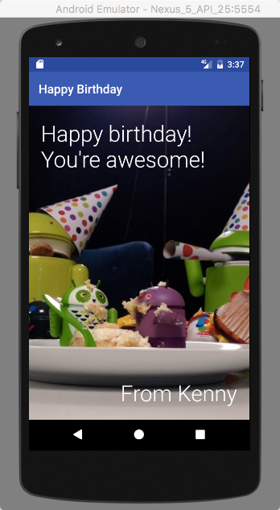

# Happy Birthday Android App
First app from the Udacity Android Basics: User Interface course.

Link to the course: https://classroom.udacity.com/courses/ud834

**Screenshot**



## Notes from the course

### Lesson 1: Building layouts

#### `TextView`
* default background color is transparent
* `dp` = Density independent pixels = read "dips"
* hard coding
* set width and height to `wrap_content`
* "set `wrap_content'
* `TextView`
* "declare an attribute"
* element -> attribute name, attribute value
* font sizes
    * sp = scale independent pixels
* `textAppearance` attribute
* `textSize` attribute
* `textColor`
* HEX value of colors

#### `ImageView`
* "drawable"
* use @ to reference a resources folder
* `scaleType` tells screen how to scale the image on the screen
    * `center`, `centerCrop`
* "full bleed image" means that images go from edge to edge
* images in dp
* `android:textStyle`
    * "constant values" of `normal`, `bold`, `italic`

### Material design
* keylines
* typography
* colors
* navigation drawer, status bar

#### `ViewGroups`
* container for views
* parent and child `ViewGroups`
* sibling views
* root view
* linear layout
    * vertical column
    * horizontal row
* relative layout
    * relative to parent or other child views
* `android:orientation`
* add xml namespace declaration in the opening tag of the root view of xml file: `xmlns:android`
* `match_parent`
    * child view matches the height/width of the parent view group
* `ViewGroup` layout parameters
    * handled by the parent parameters
    * `android:layout_height`
* `LinearLayout` weight
    * `android:layout_weight`
    * default weight value is 0
    * for spacing out views equally
* `EditText`
    * for text input


#### Relative layout
* aligns to parent top/right/bottom/left edge
* `android:layout_alignParentRight` attribute
* attributes `false` by default
* can center horizontally/vertically
* top left by default
* relative to parent or to other views
* can add `id` to views
* @ refers to a resource in the Android app
* add + for first time declaring an id
* view id names must be unique
* layout params

#### Padding and margin
* default value is 0
* margin needs ViewGroup
    * ViewGroup handles the margin
* same if background is transparent


#### Practice set 1: Android Studio
* RelativeLayout is better for overlapping views
* put images in `drawable` folder

### Quizzes

#### Quiz: `layout_weight`

```xml
<LinearLayout
    xmlns:android="http://schemas.android.com/apk/res/android"
    android:orientation="vertical"
    android:layout_width="match_parent"
    android:layout_height="match_parent">

    <ImageView
        android:src="@drawable/ocean"
        android:layout_width="match_parent"
        android:layout_height="0dp"
        android:layout_weight="1"
        android:scaleType="centerCrop" />

    <TextView
        android:text="You're invited!"
        android:layout_width="match_parent"
        android:layout_height="wrap_content"
        android:layout_weight="0"
        android:textColor="@android:color/white"
        android:textSize="54sp"
        android:background="#009688" />

    <TextView
        android:text="Bonfire at the beach"
        android:layout_width="match_parent"
        android:layout_height="wrap_content"
        android:layout_weight="0"
        android:textColor="@android:color/white"
        android:textSize="34sp"
        android:background="#009688" />

</LinearLayout>
```


#### Quiz: Relative to other views

```xml
<RelativeLayout
    xmlns:android="http://schemas.android.com/apk/res/android"
    android:layout_width="match_parent"
    android:layout_height="match_parent"
    android:background="#FF9800"
    >

    <TextView
        android:id="@+id/lyla_text_view"
        android:layout_width="wrap_content"
        android:layout_height="wrap_content"
        android:layout_alignParentBottom="true"
        android:layout_alignParentLeft="true"
        android:background="#3F51B5"
        android:textColor="#FFFFFF"
        android:textSize="24sp"
        android:text="Lyla" />

    <TextView
        android:id="@+id/me_text_view"
        android:layout_width="wrap_content"
        android:layout_height="wrap_content"
        android:layout_alignParentBottom="true"
        android:layout_toRightOf="@id/lyla_text_view"
        android:background="#3F51B5"
        android:textColor="#FFFFFF"
        android:textSize="24sp"
        android:text="Me" />

    <TextView
        android:id="@+id/natalie_text_view"
        android:layout_width="wrap_content"
        android:layout_height="wrap_content"
        android:layout_above="@id/lyla_text_view"
        android:background="#3F51B5"
        android:textColor="#FFFFFF"
        android:textSize="24sp"
        android:text="Natalie" />

    <TextView
        android:id="@+id/jennie_text_view"
        android:layout_width="wrap_content"
        android:layout_height="wrap_content"
        android:layout_alignParentBottom="true"
        android:layout_alignParentRight="true"
        android:background="#3F51B5"
        android:textColor="#FFFFFF"
        android:textSize="24sp"
        android:text="Jennie" />

    <TextView
        android:id="@+id/omoju_text_view"
        android:layout_width="wrap_content"
        android:layout_height="wrap_content"
        android:layout_alignParentRight="true"
        android:layout_above="@id/jennie_text_view"
        android:background="#3F51B5"
        android:textColor="#FFFFFF"
        android:textSize="24sp"
        android:text="Omoju" />

    <TextView
        android:id="@+id/amy_text_view"
        android:layout_width="wrap_content"
        android:layout_height="wrap_content"
        android:layout_alignParentBottom="true"
        android:layout_alignParentRight="true"
        android:layout_above="@id/omoju_text_view"
        android:background="#3F51B5"
        android:textColor="#FFFFFF"
        android:textSize="24sp"
        android:text="Amy" />

    <TextView
        android:id="@+id/ben_text_view"
        android:layout_width="wrap_content"
        android:layout_height="wrap_content"
        android:layout_alignParentTop="true"
        android:layout_centerHorizontal="true"
        android:background="#3F51B5"
        android:textColor="#FFFFFF"
        android:textSize="24sp"
        android:text="Ben" />

    <TextView
        android:id="@+id/kunal_text_view"
        android:layout_width="wrap_content"
        android:layout_height="wrap_content"
        android:layout_alignParentTop="true"
        android:layout_toLeftOf="@id/ben_text_view"
        android:background="#3F51B5"
        android:textColor="#FFFFFF"
        android:textSize="24sp"
        android:text="Kunal" />

    <TextView
        android:id="@+id/kagure_text_view"
        android:layout_width="wrap_content"
        android:layout_height="wrap_content"
        android:layout_alignParentTop="true"
        android:layout_centerHorizontal="true"
        android:layout_toRightOf="@id/ben_text_view"
        android:background="#3F51B5"
        android:textColor="#FFFFFF"
        android:textSize="24sp"
        android:text="Kagure" />

</RelativeLayout>
```

##### Quiz: List item with relative layout

```xml
<RelativeLayout
    xmlns:android="http://schemas.android.com/apk/res/android"
    android:layout_width="match_parent"
    android:layout_height="match_parent" >

    <ImageView
        android:id="@+id/photo"
        android:layout_width="56dp"
        android:layout_height="56dp"
        android:scaleType="centerCrop"
        android:src="@drawable/ocean" />

    <TextView
        android:id="@+id/name"
        android:layout_width="wrap_content"
        android:layout_height="wrap_content"
        android:text="Pebble Beach"
        android:layout_toRightOf="@id/photo"
        android:textAppearance="?android:textAppearanceMedium" />

    <TextView
        android:id="@+id/location"
        android:layout_width="wrap_content"
        android:layout_height="wrap_content"
        android:layout_toRightOf="@id/photo"
        android:layout_below="@id/name"
        android:text="California"
        android:textAppearance="?android:textAppearanceSmall" />

    <TextView
        android:id="@+id/distance"
        android:layout_width="wrap_content"
        android:layout_height="wrap_content"
        android:layout_toRightOf="@id/photo"
        android:layout_below="@id/location"
        android:text="10 miles away"
        android:textAppearance="?android:textAppearanceSmall" />

</RelativeLayout>
```


##### Quiz: Padding vs margin

```xml
<LinearLayout
    xmlns:android="http://schemas.android.com/apk/res/android"
    android:layout_width="match_parent"
    android:layout_height="match_parent"
    android:orientation="vertical">

    <ImageView
        android:src="@drawable/ocean"
        android:layout_width="match_parent"
        android:layout_height="0dp"
        android:layout_weight="1"
        android:scaleType="centerCrop"
        android:layout_marginBottom="0dp" />

    <TextView
        android:text="You're invited!"
        android:layout_width="match_parent"
        android:layout_height="wrap_content"
        android:paddingLeft="16dp"
        android:paddingTop="16dp"
        android:paddingBottom="16dp"
        android:paddingRight="16dp"
        android:textColor="@android:color/white"
        android:textSize="45sp"
        android:background="#009688"/>

    <TextView
        android:text="Bonfire at the beach"
        android:layout_width="match_parent"
        android:layout_height="wrap_content"
        android:paddingLeft="16dp"
        android:paddingBottom="16dp"
        android:paddingRight="16dp"
        android:textColor="@android:color/white"
        android:textSize="24sp"
        android:background="#009688"/>

</LinearLayout>
```
